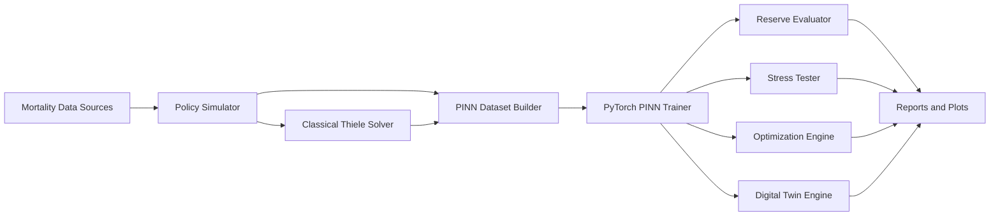

# insurance_reserve_intelligence_platform

ActuaryTwin is a production-oriented research platform for building an insurance liability digital twin using Physics-Informed Neural Networks (PINNs). The system combines a classical actuarial solver with a PyTorch PINN so liability reserves can be estimated, stressed, optimized, and simulated under business and macroeconomic scenarios.

## Project Overview

Core business positioning:

- Real-time reserve estimation
- Mortality, interest-rate, inflation, longevity, and lapse stress testing
- Sensitivity analysis with automatic differentiation
- Premium and target-reserve optimization
- Capital efficiency analysis
- Portfolio what-if analysis
- Insurance liability digital twin simulation

Initial actuarial scope:

- Product: term life insurance
- Governing reserve equation:

```text
dV/dt = rV + P - μ(S - V)
```

## Architecture Diagram



## Repository Structure

```text
insurance_reserve_intelligence_platform/
├── configs/
├── data/
├── docs/
├── insurance_reserve_intelligence_platform/
│   ├── actuarial/
│   ├── data/
│   ├── digital_twin/
│   ├── evaluators/
│   ├── losses/
│   ├── models/
│   ├── optimization/
│   ├── stress/
│   ├── toolbox/
│   ├── trainers/
│   ├── utils/
│   └── visualization/
├── tests/
├── train.py
├── evaluate.py
├── stress_test.py
└── optimize.py
```

## Installation

```bash
python3.11 -m venv .venv
source .venv/bin/activate
pip install -r requirements.txt
```

## Training

```bash
python train.py
```

Artifacts written during training:

- Checkpoints in `artifacts/checkpoints/`
- TensorBoard logs in `artifacts/tensorboard/`
- CSV metrics in `artifacts/logs/training_metrics.csv`

## Evaluation

```bash
python evaluate.py
```

This computes regression metrics and writes a sensitivity report with:

- `dV/dr`
- `dV/dμ`
- `dV/dP`
- `dV/dS`
- `d²V/dr²`

## Stress Testing

```bash
python stress_test.py
```

Stress scenarios implemented:

- Mortality shock
- Interest-rate shock
- Inflation shock
- Longevity shock
- Lapse shock

Outputs:

- CSV scenario reports
- Before-vs-after reserve plots

## Optimization

```bash
python optimize.py
```

Implemented optimization workflows:

- Target reserve optimization
- Premium optimization
- Constrained premium optimization
- Bayesian optimization integration hook

## Digital Twin Simulation

The `DigitalTwinEngine` supports:

- Reserve forecasting over policy time
- Scenario simulation on cloned portfolios
- Regime simulation under macro conditions
- Portfolio reserve simulation

Example usage:

```python
from insurance_reserve_intelligence_platform.digital_twin.engine import DigitalTwinEngine
```

## Example Outputs

Representative outputs include:

- Reserve trajectories over time
- Sensitivity bar charts
- Stress scenario comparison plots
- Scenario CSV reports
- Optimization result objects

## Documentation

- [Architecture](docs/architecture.md)
- [Mathematics](docs/mathematics.md)
- [Actuarial Background](docs/actuarial_background.md)
- [PINN Background](docs/pinn_background.md)
- [Business Use Cases](docs/business_use_cases.md)
- [Optimization](docs/optimization.md)
- [Stress Testing](docs/stress_testing.md)

## Testing

```bash
pytest
```

## Future Roadmap

- Multi-state life insurance and annuity products
- Stochastic interest-rate term structures
- Calibrated macro regime models
- Portfolio-level capital optimization under constraints
- Probabilistic reserves and uncertainty quantification
- Production API serving and monitoring integration
